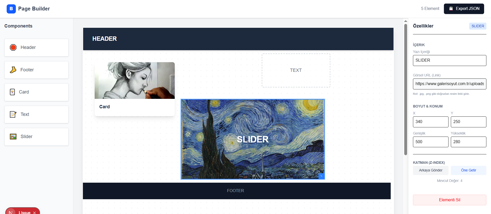
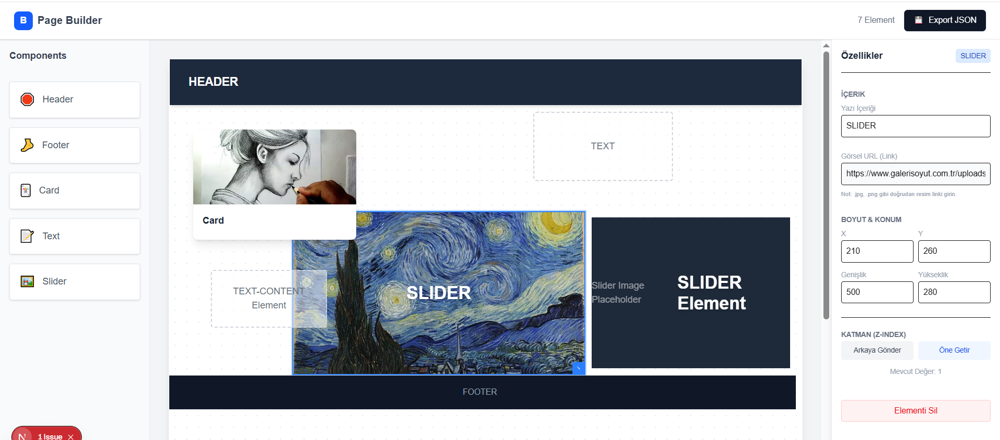

# Test Builder Case

This project is a drag & drop page builder created as a technical case work.

## Purpose
To demonstrate a basic page builder system where users can drag and drop components,
position them on a canvas and export the layout as JSON.

## Planned Features
- Drag & Drop layout builder
- Custom elements: Header, Card, Text, Slider, Footer
- Position calculation & grid snap
- Element selection & movement
- JSON export for layout
- Responsive support

## Technologies
- Next.js (App Router)
- TypeScript
- Tailwind CSS

  
    
  

## Author
Ridvan Cakar